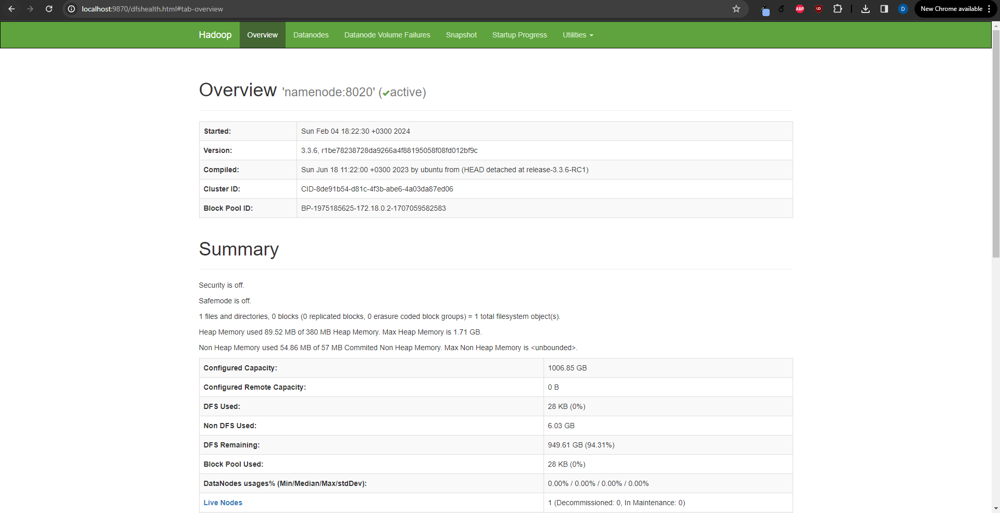
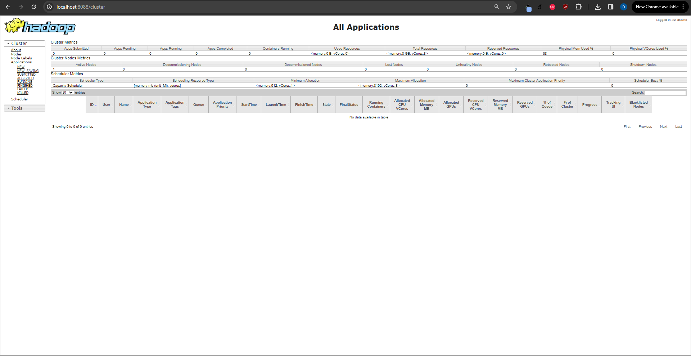
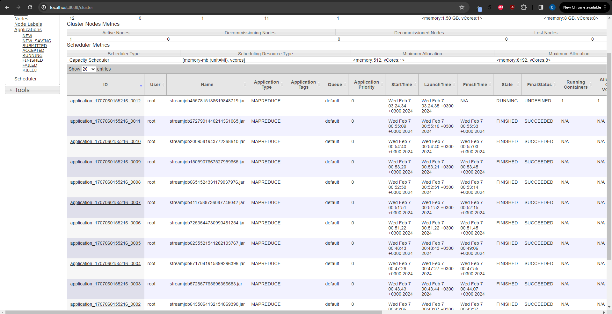
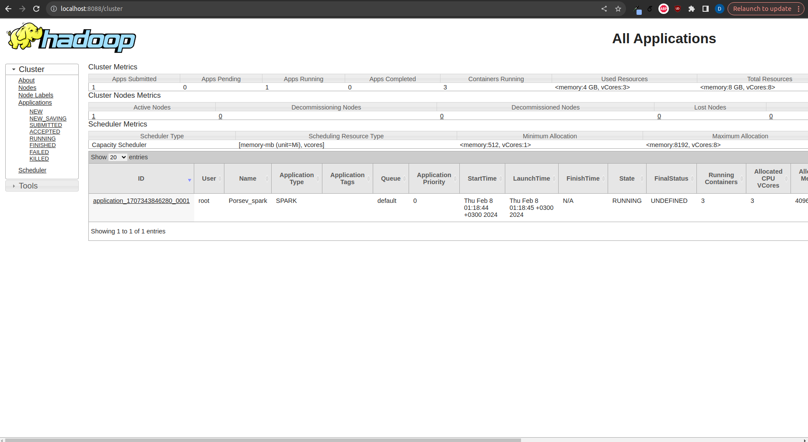
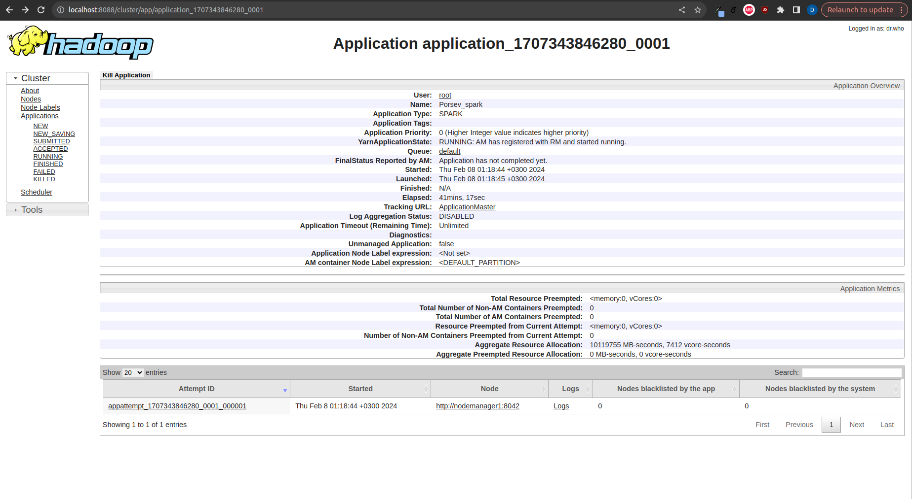
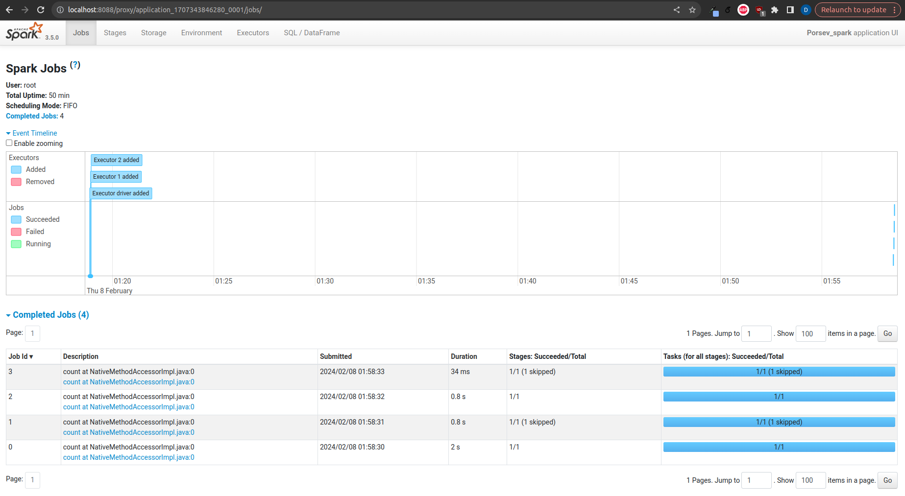
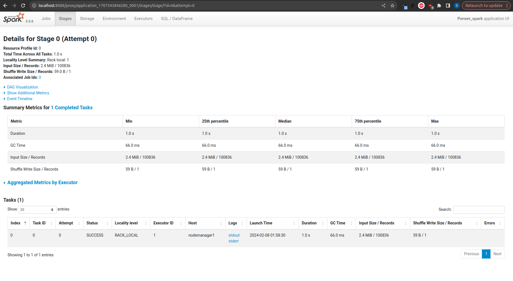
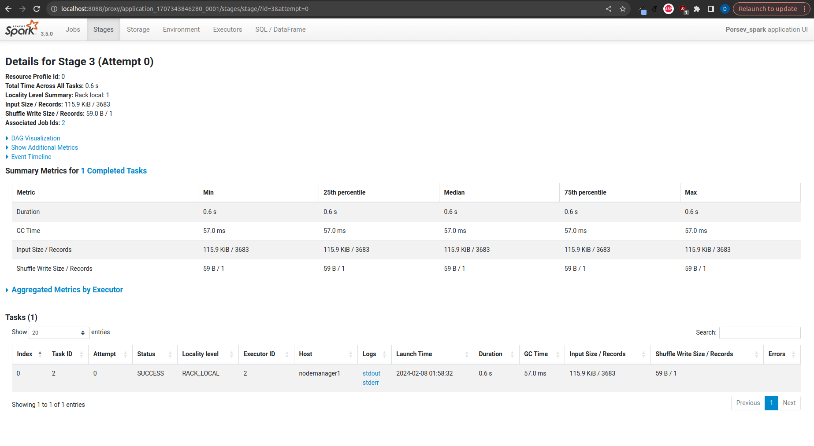

# Демо к курсу "Системы обработки и анализа больших массивов данных"

@ Денис Порсев

## Домашнее задание 1

### Блок 1

Развернут кластер в котором по одной ноде NM, DN, NM, RM

namenode

resource manager

Ноутбук с результатами заданий представлен в [notebooks/hw1_task1.ipynb](notebooks/hw1_task1.ipynb)

### Блок 2

Запуски resource manager

Задача 1: Болтун - находка для шпиона империи
- Код mapred можно найти в ноутбуке и [notebooks/count.py](notebooks/count.py)
- Команды запуска и результаты запусков в виде файлов в ноутубке [notebooks/hw1_task2_1.ipynb](notebooks/hw1_task2_1.ipynb)

Задача 2: Воодушевляющая речь
- Код mapred можно найти в ноутбуке и [notebooks/longestphrase.py](notebooks/longestphrase.py)
- Команды запуска и результаты запусков в виде файлов в ноутубке [notebooks/hw1_task2_2.ipynb](notebooks/hw1_task2_2.ipynb)

Задача 3: Кто о чем, а ситх об абсолюте
- Код mapred можно найти в ноутбуке и [notebooks/staticanalysis.py](notebooks/staticanalysis.py)
- Команды запуска и результаты запусков в виде файлов в ноутубке [notebooks/hw1_task2_3.ipynb](notebooks/hw1_task2_3.ipynb)

## Домашнее задание 2

### Блок 1

Развернут кластер аналогичный кластеру дз1 с помощью `docker-compose` в котором по одной ноде NM, DN, NM, RM

namenode

Запущена спарк-сессия с мастером YARN, 2-мя экзекьюторами и именем приложения “Porsev_spark”.

Скрины UI приложения спарк. 

Анализ таблиц директории `notebooks/ml-latest-small` представлены в ноутбуке
[notebooks/hw2_spark.ipynb](notebooks/hw2_spark.ipynb)

Скрины с выполненными Job-ами

Было выполнено 4 стейджа, 2 из которых skipped, в каждом стейдже выполнялось по одной таске.
